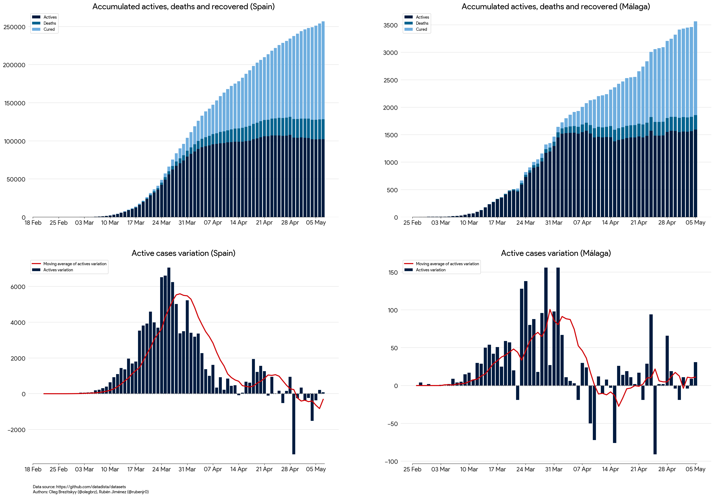

# COVID-19 data plot with Python

## Sources

- [Datadista](https://github.com/datadista/datasets/tree/master/COVID%2019)

- [Consejería de Salud y Familias de la Junta de Andalucía*](https://www.juntadeandalucia.es/institutodeestadisticaycartografia/badea/operaciones/consulta/anual/38228?CodOper=b3_2314&codConsulta=38228)

**Note that the data from Consejería de Salud y Familias de la Junta de Andalucía is one day behind the data from Datadista.**

## Requirements

- [Python](https://www.python.org/downloads/)
- [matplotlib](https://matplotlib.org/users/installing.html)
- [pandas](https://pandas.pydata.org/getting_started.html)
- [numpy](https://numpy.org/#getting-started)
- [Selenium](https://pypi.org/project/selenium/)
- [Selenium Chrome Driver](https://selenium-python.readthedocs.io/installation.html#drivers)

## Usage

```bash
python main.py
```

## Plot example

